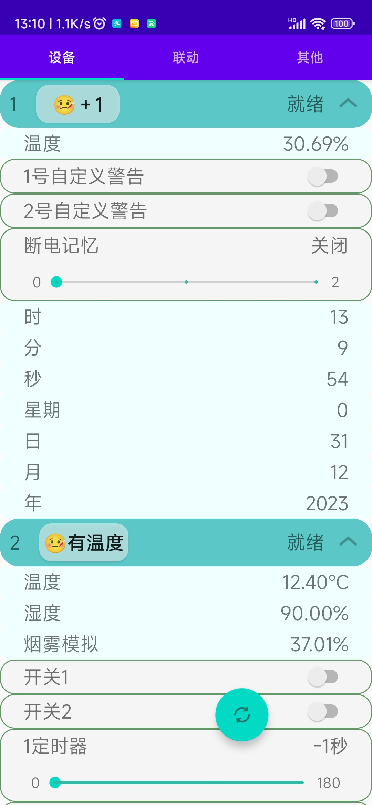
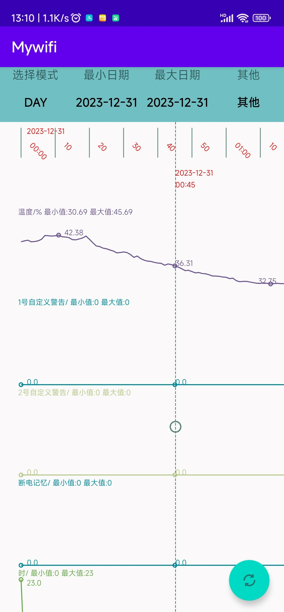

### 一个物联网项目的Android端程序 

<!--  -->


### 其他端
#### gitee
[BC-server](https://gitee.com/he_chen_chuan/BC-server)  
[esp8266 节点](https://gitee.com/he_chen_chuan/node)  

#### github
[BC-server](https://github.com/BAICHEN123/BC-server)  
[esp8266 节点](https://github.com/BAICHEN123/node)  

### 简介

#### 服务器
自行搭建服务器，或者使用预置服务器"http://121.89.243.207:8080/ok". _服务器2024年3月左右到期_  
自己搭建的服务器，需要自己修改[MyHttp.java](./app/src/main/java/com/example/mytabs/MyHttp.java)文件中的
```
static final String IP = "http://121.89.243.207:8080/";
```
~~只编译不需要搭建环境，从github上拉个分支，在网页上改一下上面那个字符串保存提交后，在github上就可以编译。~~  
目前仓库配置有问题，请自行搭建android stdio环境编译。
文档先到这里了，我去改下git上的配置